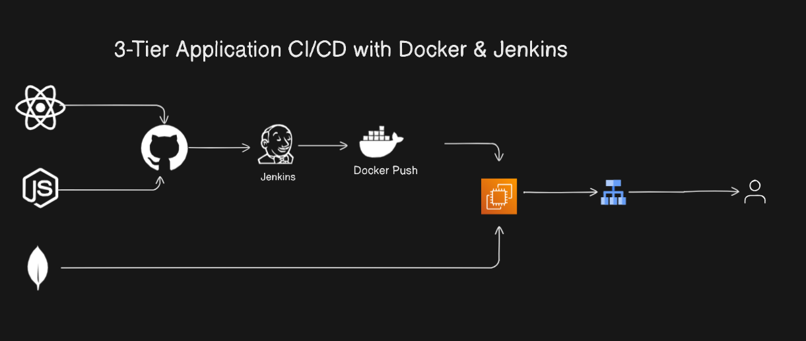

# 3-Tier Application CI/CD with Docker & Jenkins

## Architecture Diagram

## Project Overview
Welcome to the 3-Tier Application CI/CD Pipeline project! This project automates the process of building, testing, and deploying a 3-tier application using Jenkins, Docker, and Kubernetes. Developers commit code to Git, triggering Jenkins to build a Docker image, push it to Docker Hub, and deploy the application to a Kubernetes cluster. The system includes monitoring and feedback mechanisms to ensure application reliability.

---

## Features
- **CI/CD Automation**: Fully automated pipeline from code commit to deployment.
- **Docker Integration**: Builds Docker images for consistent application environments.
- **Kubernetes Deployment**: Deploys and scales applications across a Kubernetes cluster.
- **Monitoring & Feedback**: Ensures reliability and uptime with monitoring tools.

---

## Prerequisites
Ensure you have the following tools and platforms set up:
- Git
- Jenkins
- Docker
- Docker Hub Account
- Kubernetes Cluster

---

## Project Workflow

1. **Code Commit**
   Developers commit code to a Git repository.

2. **Jenkins Build Trigger**
   Jenkins is configured to monitor the repository. A new commit triggers the pipeline.

3. **Docker Image Build**
   Jenkins builds a Docker image for the application and pushes it to Docker Hub.

4. **Kubernetes Deployment**
   Jenkins deploys the Docker image to a Kubernetes cluster using `kubectl`.

5. **Monitoring**
   Feedback and monitoring tools provide insights into the application’s performance.

---

## CI/CD Pipeline Stages

### Stage 1: Code Checkout
Pulls the latest code from the Git repository.

### Stage 2: Build Docker Image
Creates a Docker image using the Dockerfile.

### Stage 3: Push Docker Image
Pushes the built image to Docker Hub for storage.

### Stage 4: Kubernetes Deployment
Uses `kubectl` to deploy the Docker image to the Kubernetes cluster.

### Stage 5: Monitoring & Feedback
Ensures the application is running as expected and collects performance data.

---

## How to Star the Repository
If you find this project helpful, please star the repository on GitHub to show your support:
1. Click the ⭐ button in the top-right corner.

---

## Author
**Jibran**  
Passionate DevOps Engineer and Software Developer.
Connect with me on [LinkedIn](https://www.linkedin.com/in/muhammad-jibran220/).

---
 

## Feedback & Contributions
Contributions are welcome! Feel free to fork the repository and submit a pull request.

---
 